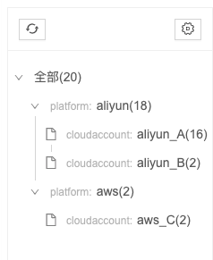

层级项目功能根据为项目打标签，并定义标签的层级，实现项目内资源的层级展示。

## 前提条件

- 需要在全局配置中开启组织架构开关。

## 配置举例

如按照平台、云账号、项目的层级来配置组织架构。

- project_A项目中仅包含阿里云平台，云账号aliyun_A上的资源；
- project_B项目中仅包含阿里云平台，云账号aliyun_B上的资源；
- project_C项目中仅包含AWS平台，云账号aws_C上的资源；

因为可以为项目打platform、cloudaccount的标签。

### 为项目打标签

目前暂不支持自动为项目打标签，需要手动为项目打标签。根据上面的举例可以按照以下内容打标签。

- project_A项目打“platform:aliyun”、“cloudaccount:aliyun_A”的标签。
- project_B项目打“platform:aliyun”、“cloudaccount:aliyun_B”的标签。
- project_C项目打“platform:aws”、“cloudaccount:aws_C”的标签。

**绑定标签**

1. 在左侧导航栏，选择 **_"认证与安全/认证体系/项目"_** 菜单项，进入项目页面。
2. 单击对应标签列图标上，在弹出的对话框中，单击 **_"编辑标签"_** 按钮，弹出编辑标签对话框。
3. 支持新建标签或绑定已有标签。
    - 绑定已有：单击 **_"已有标签"_** 按钮，显示已有的本地标签，选择标签键和值（可选），选择完成后，将在标签虚线框中显示标签。
    - 新建标签：单击列表上方 **_新建_** 按钮，设置标签键和标签值（可选），单击 **_"添加"_** 按钮，新建的标签将在标签虚线框中显示。
4. 设置完成后，单击 **_"确定"_** 按钮，为项目绑定标签。

**批量绑定标签**

1. 在左侧导航栏，选择 **_"认证与安全/认证体系/项目"_** 菜单项，进入项目页面。
2. 在项目列表中勾选多个项目，单击列表上方 **_"编辑标签"_** 按钮，弹出编辑标签对话框。
3. 支持新建标签或绑定已有标签。
    - 绑定已有：单击 **_"已有标签"_** 按钮，显示已有的本地标签，选择标签键和值（可选），选择完成后，将在标签虚线框中显示标签。
    - 新建标签：单击列表上方 **_新建_** 按钮，设置标签键和标签值（可选），单击 **_"添加"_** 按钮，新建的标签将在标签虚线框中显示。
4. 设置完成后，单击 **_"确定"_** 按钮，为项目绑定标签。

### 配置层级项目

当在全局配置中开启组织架构后，项目、虚拟机搜索框右侧将出现图标，可通过单击该图标展示组织架构、配置层级项目等。

当为项目配置完标签后，可以通过标签键配置层级关系，如举例所示，平台为层级1，云账号为层级2等，按照上述关系配置层级。

1. 在左侧导航栏，选择 **_"认证与安全/认证体系/项目"_** 菜单项，进入项目页面。
2. 单击项目搜索框右侧图标，在页面左侧展开层级项目。
3. 单击层级项目右上角图标，弹出配置层级对话框。
4. 配置以下信息：
    - 层级1：层级的取值为标签的键，如本例为“platform”。
    - 层级2~n：单击 **_"添加层级"_** 按钮，添加层级，并配置层级的取值，如本例中层级2为“cloudaccount”。
5. 单击 **_"确定"_** 按钮，配置层级关系。

### 根据层级关系过滤资源

当层级关系配置完成后，在虚拟机页面可以通过层级项目的关系，对资源进行分类。

1. 在左侧导航栏，选择 **_"主机/主机/虚拟机"_** 菜单项，进入虚拟机页面。
2. 单击虚拟机搜索框右侧图标，在页面左侧展开层级项目。
3. 将以配置的层级展示，单击对应层级，过滤对应的虚拟机资源等。
4. 如本例中单击“platform:aliyun”，将展示所有带“platform:aliyun”标签的项目的虚拟机资源。

